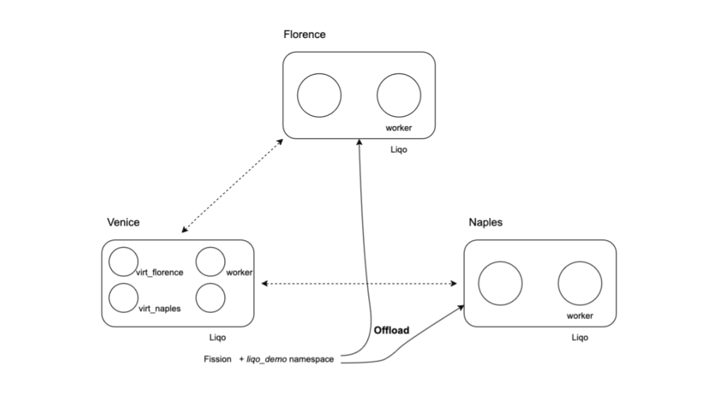

# Serverless In Multi-Kubernetes Cluster  <br> <span> Fission and Liqo Integration </span>

## Introduction
Serverless computing offers many advantages over traditional server-based architectures, including reduced operational overhead, automatic scaling, pay-as-you-go, and simplified deployment. 
Therefore, this study examines the feasibility of running serverless functions in a multi-cluster Kubernetes environment to serve as the first step towards integrating serverless computing in FLUIDOS: 
a dynamic and scalable computing continuum. The multi-cluster software of choice is Liqo as it forms a fundamental layer of FLUIDOS. The serverless framework that we selected is Fission.

## Fission
Fission is an open-source, Kubernetes-native serverless framework that allows you to run code without provisioning or managing servers. Written in Go, Fission is designed to be lightweight, 
extensible, and easy to integrate with existing Kubernetes clusters.

### Features of Fission
- __Event-Driven:__ Fission supports event-driven architecture, allowing functions to be triggered by various types of events, including HTTP requests, timers, and message queues.
- __Language Agnostic:__ Although Fission itself is written in Go, it supports multiple programming languages, including Python, Node.js, Java, and more.
- __Auto-Scaling:__ Fission automatically scales the number of function instances based on the incoming traffic, which is particularly useful for handling bursty workloads.
- __Rich Ecosystem:__ Fission has a rich set of plugins and integrations, making it easier to connect with databases, message queues, and other services.
- __Fast Cold Starts:__ Fission is optimised for fast cold starts, enabling functions to be quickly initialized when they are triggered.
  
__Other features include:__
- __Community Support:__ Fission has an active community and a wealth of documentation, which can be beneficial for troubleshooting and extending functionalities.
- __Kubernetes-Native:__ Fission natively operates in a Kubernetes cluster.
- __Fission supports two types of deployments:__ PoolManager and NewDeploy. Our experiment utilises PoolManager as it is optimised for functions that are short-living and require a short cold start time [4].

## Liqo
Liqo (Linked Clusters Over the Edge) is an open-source project aimed at extending Kubernetes clusters across multiple cloud providers and on-premises installations. It allows for seamless and transparent 
resource sharing and workload offloading between clusters.

### Features of Liqo
- __Cluster Federation:__ Liqo enables the federation of multiple Kubernetes clusters, allowing them to act as a single, unified system.
- __Resource Sharing:__ Liqo allows clusters to share resources like CPU and memory, enabling more efficient utilization.
- __Dynamic Discovery:__ Liqo can dynamically discover and connect to other clusters, making it easier to scale and manage resources.
- __Workload Offloading:__ Liqo can offload workloads from one cluster to another based on resource availability, thereby optimizing performance and costs.

## Liqo and Fission In FLUIDOS
We assume that the FLUIDOS intent-based orchestrator translates users’ requests to a YAML configuration file that Fission can process. The integration of Fission and Liqo in a FLUIDOS environment would involve 
several key steps:

1. __Initial Setup:__ 
    - Deploy Liqo to support a multi-cluster Kubernetes environment creation.
    - Deploy Fission to support serverless computation
2. __Environment Deployment:__ define the pool size for the environment pods. Liqo scheduler distributes them uniformly across the multi-cluster environment.
3. __Function Deployment:__ Use Fission to deploy serverless functions across the federated clusters managed by Liqo.
4. __Resource Allocation:__ Utilize Liqo's resource-sharing capabilities to allocate resources for Fission functions dynamically.
5. __Event Handling:__ Configure Fission to trigger functions based on events occurring in the Liqo-managed clusters.
   
The integration of Fission and Liqo offers a promising avenue for implementing serverless computing in a dynamic and scalable computing continuum like FLUIDOS. Both technologies complement each other well, 
offering a robust, scalable, and efficient solution for modern cloud-native applications. 

## Fission Installation in a Multi-Cluster Liqo Environment
This experiment aims to show that by installing Fission in one of the Liqo clusters, the Liqo scheduler is able to execute serverless functions in any cluster within the Liqo multi-cluster environment. 
Using Kind we created three clusters, namely, Venice, Naples, and Florence to create a Liqo multi-cluster environment. Then, we installed Fission in the Venice cluster and offloaded the namespace 
`liqo-demo` to the other clusters.

### Experiment Setup
We began by exploring Liqo's namespace offloading [2] and extended it by installing Fission on the Venice cluster. This cluster's namespace was then offloaded to both the Naples and Florence clusters. 
A minor modification was made to Fission's standard installation process [3] to specify an alternative namespace `liqo-demo` for environment pod creation.


#### Software Used
- Kind v20.0
- Liqo v0.9.3
- Fission v1.19

#### Installation Procedure

The installation was initiated by running `setup.sh` as outlined in [2], with some modifications (highlighted in blue):
- Each cluster was configured with a worker node.
- For the Venice cluster, an additional port mapping was added to facilitate HTTP communication.

The YAML configuration for the Venice cluster was as follows:
```yaml
# cluster_with_worker.yaml

kind: Cluster
apiVersion: kind.x-k8s.io/v1alpha4
networking:
  serviceSubnet: "10.90.0.0/12"
  podSubnet: "10.200.0.0/16"
nodes:
  - role: control-plane
    image: kindest/node:v1.25.0
    extraPortMappings:
    - containerPort: 31314
      hostPort: 30090
  - role: worker
    image: kindest/node:v1.25.0
```
For the Naples and Florence clusters, we used:

```yaml
# cluster_with_worker2.yaml

kind: Cluster
apiVersion: kind.x-k8s.io/v1alpha4
networking:
  serviceSubnet: "10.90.0.0/12"
  podSubnet: "10.200.0.0/16"
nodes:
  - role: control-plane
    image: kindest/node:v1.25.0
  - role: worker
    image: kindest/node:v1.25.0
```
After the creation of clusters in Kind, Liqo is installed in each cluster. Subsequently, Fission was installed in the Venice cluster and the `liqo-demo` namespace was added using the following command
```
helm install --version v1.19.0 --namespace $FISSION_NAMESPACE fission \
  --set serviceType=NodePort,routerServiceType=NodePort \
  --set "additionalFissionNamespaces={liqo-demo}" fission-charts/fission-all --kubeconfig=$KUBECONFIG
```
Peering relationships were established between Venice and both Florence and Naples clusters (Figure 1). The `liqo-demo` namespace was then offloaded from Venice to these clusters using the following `liqoctl` command.
```
liqoctl offload namespace liqo-demo  --namespace-mapping-strategy EnforceSameName \
      --pod-offloading-strategy LocalAndRemote \
      --selector 'topology.liqo.io/region in (center,south)'  --kubeconfig=$KUBECONFIG
```


Figure 1: Liqo multi-cluster environment. 

From the perspective of the Venice cluster, there are 4 nodes: a control plan node, worker node, and two virtual nodes created by Liqo as indicated by the log below.

```shell
NODE            TAINTS

liqo-florence	        [map[effect:NoExecute key:virtual-node.liqo.io/not-allowed value:true]]
liqo-naples             [map[effect:NoExecute key:virtual-node.liqo.io/not-allowed value:true]]
venice-control-plane    [map[effect:NoSchedule key:node-role.kubernetes.io/control-plane]]
venice-worker          <none>
```

This means that the Florence and Naples clusters are now accessible from the Venice cluster.

Finally, we should notice that for each cluster we have a unique kube config file. We will use these files to check the state inside each individual cluster.

```shell
export KUBECONFIG=<path>/config/kubeconf/liqo_kubeconf_venice  
export KUBECONFIG_FLORENCE=<path>/config/kubeconf/liqo_kubeconf_florence
export KUBECONFIG_NAPLES=<path>/config/kubeconf/liqo_kubeconf_naples

kubectl get pods -A -o wide --kubeconfig $KUBECONFIG
kubectl get pods -A -o wide --kubeconfig $KUBECONFIG_FLORENCE
kubectl get pods -A -o wide --kubeconfig $KUBECONFIG_NAPLES
```


